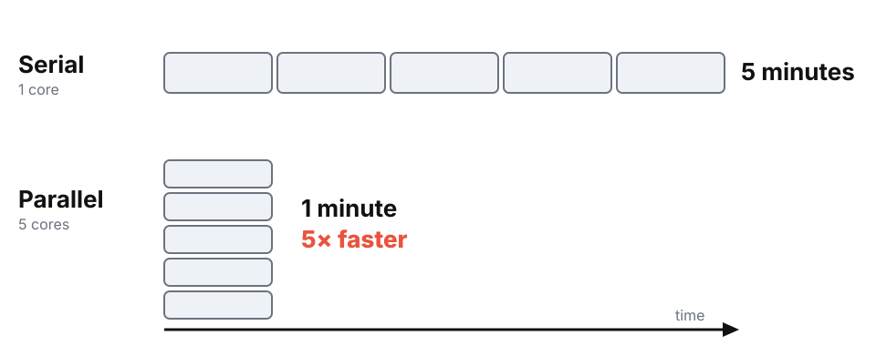
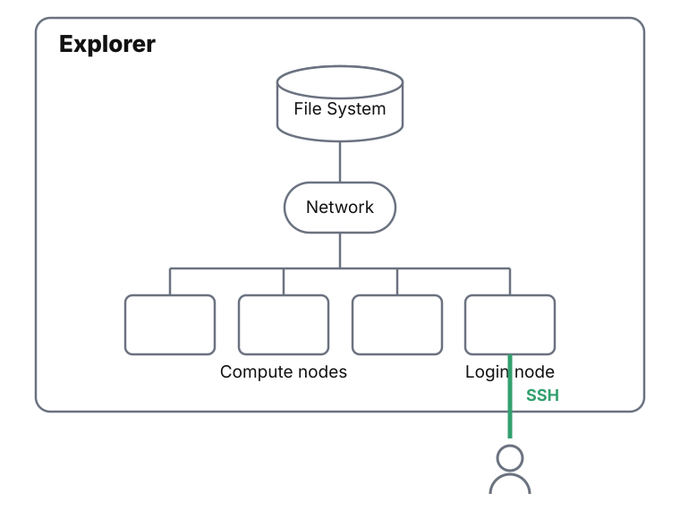
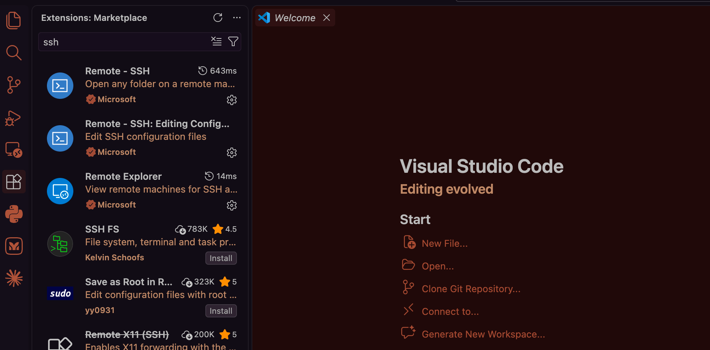
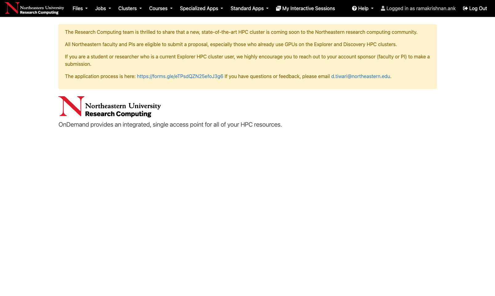
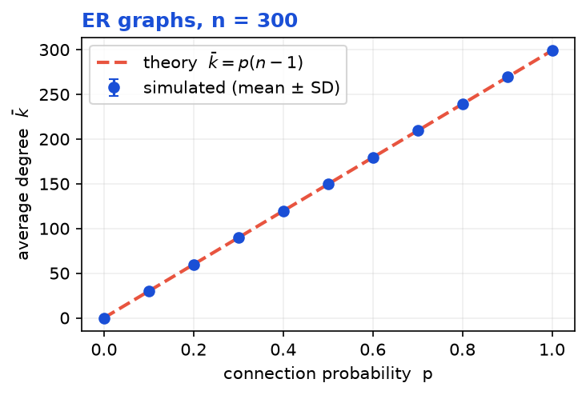

<!-- _class: title -->

<span class="eyebrow">NetSI PhD Bootcamp 2026 · Thursday, Sep 3 · 10am–12pm</span>

# Networks on the Cluster

> Run your network science on Explorer

Ankit Ramakrishnan · Minami Ueda

<span class="brandmark">Network Science Institute <span class="accent">·</span> Northeastern University</span>

---

# How this session works

- **~45 min**, guided speed-run: get onto Explorer and run a real job
- **~60 min**, <span class="pill">Hackathon</span> pick one of three tracks
- **~15 min**, lightning share-outs

By the end you'll have **submitted a parallel job on Explorer**.

---

<!-- _class: divider -->

# Part 1: Speed-run

<span class="brandmark">NetSI Bootcamp 2026</span>

---

# Why a cluster?

> Parallel computing saves time by doing many things at once



*Assuming the calculations don't depend on each other.*

---

# Why not one big workstation?

A single 64-core box hits walls:

- **Scalability**, what if you need 1,000 cores or 2 TB of RAM?
- **Availability**, a 2-week run holds the whole machine hostage
- **Efficiency**, expensive hardware sits idle between big runs
- **Concurrency**, 10 people can't all run at once

---

# The solution: an HPC cluster

> Many computers on a fast network, acting as one system

<span class="stat">1,024</span> CPU nodes &nbsp;&nbsp; <span class="stat">~50k</span> cores &nbsp;&nbsp; <span class="stat">200+</span> GPUs

**Explorer** is Northeastern's cluster, hosted at MGHPCC in Holyoke, MA.

<span class="srcnote">Source: <a href="https://rc-docs.northeastern.edu">rc-docs.northeastern.edu</a></span>

---

# The pieces



---

# Key terms

- **Node**, one computer in the cluster
  - **Login node**, where you edit files & submit jobs (*don't* compute here)
  - **Compute node**, the workhorses where jobs actually run
- **Partition**, a named pool of nodes, e.g. `short` (CPU), `gpu-short` (GPU)
- **Job**, a resource request + the commands to run
- **Job array**, many similar jobs from one script (`--array=1-N`)

<span class="srcnote">Partition details: <a href="https://rc.northeastern.edu/partitions/">rc.northeastern.edu/partitions</a></span>

---

# Slurm runs the show

> **S**imple **L**inux **U**tility for **R**esource **M**anagement

- Manages the **queue** of everyone's jobs
- Assigns your job to free compute nodes
- Keeps sharing **fair and efficient**

You describe *what you need*; Slurm decides *where and when*.


---

# Slurm commands you'll use

```bash
sbatch job.sh              # submit a job
squeue --me                # your jobs   (ST: PD = pending, R = running)
scancel 12345              # cancel a job by id
srun -p short --pty bash -i   # interactive shell on a node
```

---

# Are you ready?

> Three checks before we get hands-on

1. **Connect** ▸ `ssh explorer` logs you in without a password
2. **Get the code** ▸ `git clone <repo>` (URL from instructors)
3. **Edit on the cluster** ▸ VS Code Remote-SSH or an OOD terminal

*Not set up yet?* No problem, we walk through SSH next (it's also in `SETUP.md`). Blocked? Use Open OnDemand in a browser, or pair with a neighbor.

---

<!-- _class: divider -->

# Getting on Explorer

### One-time setup, then it just works

<span class="brandmark">NetSI Bootcamp 2026</span>

---

# Set up SSH once

<span class="pill">Hands-on Session</span>

Create a key (skip if you already have one):

```bash
ssh-keygen -t rsa     # press Enter through the prompts, no passphrase
```

Add a host alias, put this in `~/.ssh/config`:

```ssh-config
Host explorer
    HostName login.explorer.northeastern.edu
    User YOUR_USERNAME          # your NU username, e.g. lastname.f
    IdentityFile ~/.ssh/id_rsa
```

---

# Enable passwordless login

<span class="pill">Hands-on Session</span>

Copy your key up to Explorer (type your NU password once):

```bash
ssh-copy-id -i ~/.ssh/id_rsa.pub YOUR_USERNAME@login.explorer.northeastern.edu
```

Now this logs you straight in, no password, no typing the long host:

```bash
ssh explorer
```

*Passwordless SSH is required for OOD / GUI apps to launch cleanly.*

---

# On Windows: same idea, two tweaks

> Built-in OpenSSH works. Your config lives at `C:\Users\<you>\.ssh\config`

- **Easiest: use Git Bash.** Every command on the last two slides works as-is, *including* `ssh-copy-id`.
- **PowerShell** works too, but has no `ssh-copy-id`. After `ssh-keygen` and the same config, copy your key up:

```powershell
$k = "$env:USERPROFILE\.ssh\id_rsa.pub"
type $k | ssh explorer "mkdir -p ~/.ssh; cat >> ~/.ssh/authorized_keys"
```

VS Code Remote-SSH reads the same `config`, so `explorer` shows up the same way.

---

# Two doors into Explorer

- **VS Code Remote-SSH** ▸ command palette ▸ *Connect to Host* ▸ pick **`explorer`**
- **Open OnDemand** ▸ web portal at [ood.explorer.northeastern.edu](https://ood.explorer.northeastern.edu)

<div class="shots">


</div>

<span class="caption">VS Code Remote-SSH gives you an editor and terminal on the cluster (left). Open OnDemand runs files, JupyterLab, and job monitoring in the browser (right).</span>

---

# Shell survival kit

```bash
pwd                  # where am I?
ls                   # what's here?
cd my_project        # move into a folder
mkdir bootcamp       # make a folder
cat notes.txt        # print a file
```

Everything below runs in the terminal, VS Code's or OOD's, same thing.

---

# Jump onto a compute node

<span class="pill">Hands-on Session</span>

> The login node is shared. For a quick test, grab your own compute node:

```bash
hostname                       # login node, e.g. explorer-01

srun -p short --time=00:30:00 --pty bash   # ask Slurm for a live shell
# (waits a moment while it allocates)

hostname                       # now a compute node, e.g. c0613
exit                           # release it, back to the login node
```

Great for quick tests and debugging. For real work, submit a **batch** job (next).

---

# Get the example code

<span class="pill">Hands-on Session</span>

```bash
# clone this bootcamp's repo (URL from your instructors)
git clone https://github.com/TheChesireCat/bootcamp-2026
cd bootcamp-2026/hackathon/cluster
ls
# 00-hello  track-a-parallel-sim  track-b-gnn-gpu  track-c-big-graph
```

Everything we run today lives here.

---

# Software: environment modules

> Major scientific software is pre-installed, just load it

```bash
module avail                 # browse everything available
module load anaconda3        # unlock the `conda` command
module list                  # what's loaded now
```

---

# Software: conda environments

> Your own isolated, reproducible Python

```bash
module load anaconda3
conda create -n bootcamp python=3.11 networkx numpy pandas matplotlib
source activate bootcamp

which python3                # now points inside your env
# /home/YOUR_USERNAME/.conda/envs/bootcamp/bin/python3
```

*Start this now: the array-job walkthrough coming up (Steps 1-2) runs in `bootcamp`. Solving takes a few minutes, so kick it off, then keep following along. (The hello job itself just uses `base`.)*

---

# Anatomy of a batch file

```bash
#!/bin/bash
#SBATCH --job-name=hello-cluster
#SBATCH --partition=short          # the old "express" is retired
#SBATCH --time=0-00:05:00
#SBATCH --ntasks=1
#SBATCH --cpus-per-task=1

module load anaconda3
source activate base       # hello_cluster.py has no dependencies
python3 hello_cluster.py
```

**Resources up top** (`#SBATCH`), then the **commands to run**.

---

# Submit, watch, collect

<span class="pill">Hands-on Session</span>

```bash
cd 00-hello
sbatch job.sh                 # ▸ Submitted batch job 49725148

watch -n 1 squeue --me        # ST: PD=pending, R=running (Ctrl-C to quit)

ls
# hello_cluster.py  job.sh  slurm-49725148.out
```

Open the `slurm-*.out` file, that's your job's output.

---

# One script, many runs

> The real superpower: **job arrays**

ER graphs, how does average degree depend on connection prob `p`?

- 11 values of `p` × 100 trials = **1,100 simulations**, all independent
- One array fans them out; a second job aggregates + plots

```bash
#SBATCH --array=1-11        # one task per p-value
```

Result: **k̄ = p (n − 1)**. Let's actually run it.

---

# The array job: two steps

> One folder, two jobs: simulate, then plot

```bash
cd track-a-parallel-sim
ls
# sim.py  job_sim.sh  plot.py  job_plot.sh
```

- `sim.py` + `job_sim.sh`: run **11 tasks** (one per `p`) ▸ `results/p_*.csv`
- `plot.py` + `job_plot.sh`: read the CSVs ▸ `figs/avg_degree_vs_p.png`

---

# Step 1: run the simulation

<span class="pill">Hands-on Session</span>

```bash
# open job_sim.sh, set your email (or delete the --mail lines)

sbatch job_sim.sh              # ▸ Submitted batch job 51234567
watch -n 1 squeue --me         # 11 array tasks appear, one per p

ls results/
# p_0.0.csv  p_0.1.csv  ...  p_1.0.csv
```

Each task wrote its **own** CSV. That's the array at work.

---

# Step 2: plot the results

<span class="pill">Hands-on Session</span>

```bash
sbatch job_plot.sh
ls figs/
# avg_degree_vs_p.png
```

- Open `figs/avg_degree_vs_p.png`, that's your result ▸

---

# The payoff



<span class="caption">11 array tasks, one figure: the simulated points land right on the theory line **k̄ = p(n−1)**.</span>

You just ran a real parallel study. Now go make it *your own*.

---

# If you get stuck

| Symptom | Fix |
| --- | --- |
| `ssh`: `Permission denied` | rerun `ssh-copy-id`, or use OOD instead |
| Job sits in `PD` (pending) | queue is busy, lower `--time` / `--mem` or wait |
| `conda: command not found` | run `module load anaconda3` first |
| CUDA: `no kernel image` | pin `--gres=gpu:v100-sxm2:1` + matching `cuda/` |

> Still stuck? Pair with a neighbor or grab an instructor, don't burn 20 minutes solo.

---

<!-- _class: divider -->

# Part 2: Hackathon

### Pick a track. Explore Explorer.

<span class="brandmark">NetSI Bootcamp 2026</span>

---

# Choose your own adventure

| Track | Difficulty | Compute |
| --- | --- | --- |
| **A · Parallel simulations** | <span class="level beginner">beginner</span> | CPU (`short`) |
| **B · GNN on GPU** | <span class="level intermediate">intermediate</span> | `gpu-short` |
| **C · Big-graph generate & analyze** | <span class="level intermediate">intermediate</span> | CPU (`short`) |

Starter code + step-by-step: **`hackathon/cluster/`**

---

# Track A: Parallel simulations

> <span class="level beginner">beginner</span> Take the ER job array and make it *your* experiment

- Sweep a parameter, run trials in parallel, aggregate into one figure
- Learn: `--array`, per-task output files, a simulate ▸ plot workflow
- Everything runs on `short`, no GPU needed

▸ `hackathon/cluster/track-a-parallel-sim/`

---

# Track A: what could you study?

Same pattern every time: **sweep a parameter, measure a property, plot.**

- **Giant component:** sweep mean degree in ER, watch it jump at `mean degree = 1`
- **Small world:** sweep rewiring in Watts-Strogatz, watch path length collapse
- **Scale-free:** sweep `m` in Barabási-Albert, look at the degree tail
- **Robustness:** remove nodes randomly vs by degree, track the largest component
- **Epidemics:** sweep infection rate, find where outbreaks take off

Full menu with hints: `track-a-parallel-sim/README.md`

---

# Track B: GNN on GPU

> <span class="level intermediate">intermediate</span> Train a graph neural net on a real GPU

- Node classification (Cora / karate club) with PyTorch Geometric
- Request a GPU: `-p gpu-short --gres=gpu:v100-sxm2:1`
- Learn: GPU jobs, `nvidia-smi`, matching CUDA to your build, CPU fallback

▸ `hackathon/cluster/track-b-gnn-gpu/`

---

# Picking a GPU (don't just say `gpu:1`)

Explorer mixes old and new cards, the type changes what runs:

| `--gres=gpu:TYPE:1` | Card | Good for |
| --- | --- | --- |
| **`v100-sxm2`** ⭐ | V100, 32 GB | our default, always works, tons available |
| `a100` | A100, 40–80 GB | bf16 / TF32 / big memory |
| `h200` | H200, 141 GB | newest; needs recent CUDA + matching PyTorch |
| `t4` | T4, 16 GB | small / inference only |

> ⚠️ Mismatched CUDA ▸ *"no kernel image is available for execution on the device."*
> Pin **`v100-sxm2`** and you'll avoid it.

<span class="srcnote">GPU types verified on Explorer, 2026-08-31</span>

---

# Track C: Big-graph generate & analyze

> <span class="level intermediate">intermediate</span> Push the cluster with large networks

- Generate big graphs across an array, measure properties, aggregate
- Learn: scaling with array jobs, memory requests (`--mem`), combining results
- Watch a task run out of memory, then fix the request

▸ `hackathon/cluster/track-c-big-graph/`

---

# Share-outs

> 60 seconds each

- **What I ran** (which track, what question)
- **What worked**
- **What broke**, and how you dealt with it
- **What surprised you**

---

<!-- _class: divider -->

# Best practices & resources

### Good habits, and where to go next

<span class="brandmark">NetSI Bootcamp 2026</span>

---

# Play nice on shared hardware

> Explorer is shared by everyone, so be a good neighbor

- **Never** run heavy work on the login node, submit with `sbatch` or grab a node with `srun`
- Set a realistic `--time`, and cap array concurrency: `--array=1-100%10`
- Job stuck, or won't release its nodes? Email [rchelp@northeastern.edu](mailto:rchelp@northeastern.edu)

---

# Put files in the right place

| Location | Use it for | Watch out |
| --- | --- | --- |
| `~/` (home) | code, small files | small quota |
| `/scratch` | large temp data | *purged periodically* |
| `/projects/netsi` | lab / project storage | shared with NetSI |

> Don't keep anything you can't lose in `/scratch`.

<span class="srcnote">Source: <a href="https://rc-docs.northeastern.edu">rc-docs.northeastern.edu</a></span>

---

# Write code future-you can run

- **Docstrings + comments** that explain *why*, not what
- **Log, don't `print`**, so you can debug a job that failed at 3am
- Feed the Slurm task id in as a CLI arg, index into a parameter list
- With an LLM, be the *architect*: design the workflow, then let it fill in code

```python
task_id = int(sys.argv[1])       # from #SBATCH --array
params  = PARAM_SETS[task_id]     # this task's parameters
```

---

# Make it reproducible

- **Use git**, commit as you go, push to GitHub as an off-cluster backup
- **One conda env per project**, so package versions don't collide
- Future-you and your collaborators can rebuild the exact run

```bash
conda create -n myproject python=3.11 networkx numpy
git init && git remote add origin <your-repo>   # backup + history
```

---

# Where to get more compute

> Develop on Explorer first, then scale out

- **AICR** [rc.northeastern.edu/aicr](https://rc.northeastern.edu/aicr): the Mass. AI Hub cluster, B200 + RTX6000 Pro GPUs, an extension of Explorer. Your *PI submits a project proposal*.
- **NAIRR pilot** [nairrpilot.org](https://nairrpilot.org): free national GPU allocations
- **Free notebooks**: Colab [colab.research.google.com](https://colab.research.google.com), Kaggle [kaggle.com](https://www.kaggle.com)

Full list, plus free platforms and cheap rentals: *`RESOURCES.md`*

---

# Keep learning

- Explorer docs: [rc-docs.northeastern.edu](https://rc-docs.northeastern.edu)
- Northeastern IT alerts: join [**`#northeastern-it-status`**](https://nunetsi.slack.com/archives/C080CNUT7LK) in Slack
- **GitHub Student Pack** (free Copilot, credits): [education.github.com/pack](https://education.github.com/pack)
- Learn git by doing: [learngitbranching.js.org](https://learngitbranching.js.org)
- PHYS7332 network science book: [asmithh.github.io/network-science-data-book](https://asmithh.github.io/network-science-data-book)

Everything above, with links, lives in *`RESOURCES.md`*.

---

# Takeaways

- You can now: **connect, build an env, submit jobs, fan out with arrays**
- The pattern behind almost all of it: *many independent jobs, one script*
- Docs: [rc-docs.northeastern.edu](https://rc-docs.northeastern.edu)

> Same problems, but faster, bring this to the **2pm Agentic session**.
