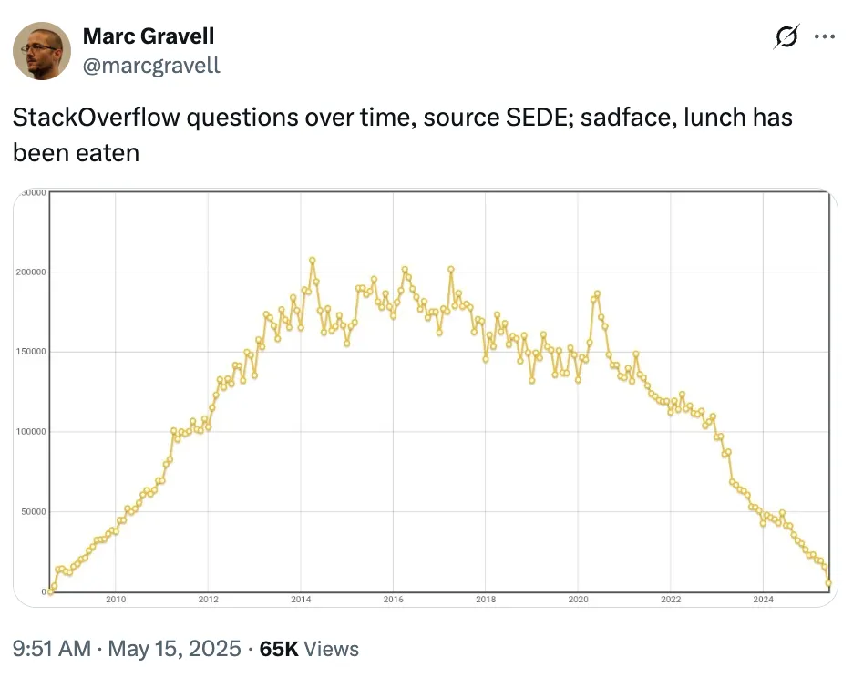
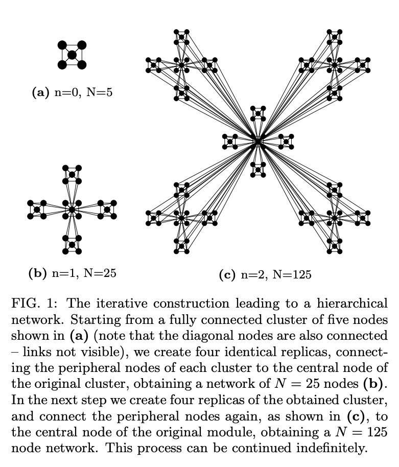
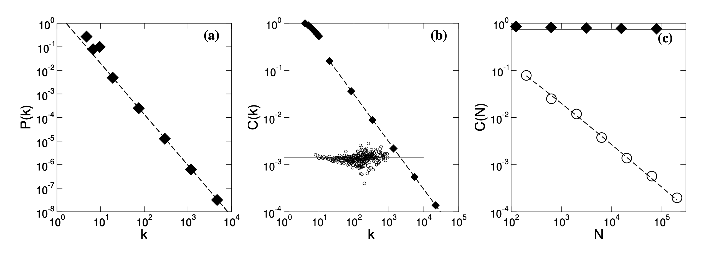

<!-- _class: title -->

<span class="eyebrow">NetSI PhD Bootcamp 2026 · Thursday, Sep 3 · 2pm–4pm</span>

# Agentic Computing

> Coding agents in your PhD workflow

Ankit Ramakrishnan · Minami Ueda

<span class="brandmark">Network Science Institute <span class="accent">·</span> Northeastern University</span>

---

# How this session works

- **~50 min** guided speed-run: setup, the basics, and how to drive an agent well
- **~55 min** <span class="pill">Hackathon</span> pick one of three projects to build
- **~15 min** share-outs

---

# Setup (do this now)

<span class="pill">Hands-on Session</span>

1. Go to [claude.northeastern.edu](https://claude.northeastern.edu), click **First time? Start here**, accept the guidelines
2. Log in with **SSO** (your NU email + credentials)
3. Install **Claude Code**: [code.claude.com/docs/quickstart](https://code.claude.com/docs/en/quickstart) (terminal + desktop)

Generous NU usage limits. Prefer something else? OpenAI Codex or opencode (open source) work too.

---

# Open both: the GUI and the terminal

<span class="pill">Hands-on Session</span>

- **Claude Desktop** (the GUI): chat, drag in files and images, quick questions
- **Claude Code** (the terminal): run `claude` inside a project, it reads and edits your files and runs commands
- Same account, same models. Use the GUI to think, the terminal to build

<!-- TODO images: ../assets/screenshots/claude-desktop.png (GUI) and ../assets/screenshots/claude-terminal.png (terminal) -->
<span class="caption">[ screenshots to add: Claude Desktop (left) and Claude Code in a terminal (right) ]</span>

---

<!-- _class: divider -->

# Basics

<span class="brandmark">NetSI Bootcamp 2026</span>

---

# What is an agent?

> An LLM that can read files, run commands, and edit code, in a loop

- You give a *goal*; it plans, acts, checks its own work, and repeats
- It works on your **whole project**, in your terminal, not just one snippet
- You stay the reviewer: it drafts, *you* decide what to keep

Think pair-programmer that can also run the tests and read the errors.

---

# CLAUDE.md: your project's system prompt

> Standing instructions the agent reads *every* session

- `/init` drafts one from your codebase. Keep it short: stack, how to run things, do's and don'ts
- The more it knows about your project, the better it performs
- Curious what strong system prompts look like? Read Anthropic's published ones: [platform.claude.com/docs](https://platform.claude.com/docs/en/release-notes/system-prompts/overview)

```md
# CLAUDE.md
- Python 3.11, networkx + matplotlib. Submit with `sbatch`, never compute on the login node.
- Small diffs. Show me a plan before editing more than one file.
```

---

# Which model?

> Pick the brain for the job (switch with `/model`)

- **Opus** (4.8, 5): your **default**. Planning, implementation, hard reasoning, gnarly bugs
- **Sonnet**: faster and cheaper, for basic or mechanical tasks
- **Haiku**: cheapest, for trivial tasks

Rule of thumb: **use Opus for almost everything**, drop to Sonnet only for very basic things.

---

# Track everything with git

> Commit often so you can always go back

- **Commit frequently**, and **push** to a remote (GitHub) as an off-machine backup
- `git diff` to review what the agent changed; `git restore <file>` to undo just one file
- **Browse the history visually** in VS Code's **Timeline** view (Explorer sidebar), no `git log` needed
- Let the agent run git for you, but understand each step. That is what makes experimenting safe

---

# Text is supreme: work in markdown

> Notes, ideas, plans, and docs, all as plain `.md`

- Store your thinking where the agent can read it: notes, half-baked ideas, plans, design docs
- Text is **versionable, diffable, and agent-native**. A plan in markdown beats a plan in your head
- (LaTeX source is text too 😉)

---

<!-- _class: divider -->

# Driving the agent

<span class="brandmark">NetSI Bootcamp 2026</span>

---

# Start a task: seed context, then brainstorm

- `/init <idea>` to give the agent a starting point
- **Brainstorm here.** Throw new, not-fully-formed thoughts at it and talk them through
- This early back-and-forth builds the context that makes everything after it better

---

# Plan before you build: `/plan`

> Planning is the highest-leverage step

- It asks *you* questions. **Iterate over the plan several times** before any code
- Later: skills like `/grill-me` push you with harder questions
- **You** make the decisions, not the agent, especially:
  - architecture and design
  - anything that is messy to undo once you start

---

# Stay in control

- Press **`esc`** to stop it mid-run: **stop and steer**. Talk to it the moment you see a mistake
- It sounds **confident even when it is wrong**. You own every command it runs, read before you approve
- **Never** put secrets (keys, passwords, private data) into a prompt
- **Do NOT use `--dangerously-skip-permissions`** yet. It acts without asking and can wipe a week's work. Only once you are confident and the task is safe

---

# Skills: reusable instructions

> Packaged text for tasks you repeat

- A skill teaches a workflow once, then you reuse it: `review`, learn a package, a house style
- Have the agent **mine your history** for skills worth extracting
- Skills enrich context, and more context means better performance
- Examples: `presentations`, `grill`, `review`. Build your own

---

# Subagents: clones with a fresh start

> A helper agent that starts from only what the parent tells it

- Great for a self-contained side task (a review, a focused search)
- They burn **lots of tokens**, and it grows fast the more you spawn. Use them judiciously
- Match the model to the job:
  - rename files `▸` Sonnet/Haiku
  - research overview `▸` Opus

---

<!-- _class: divider -->

# Using it for research

<span class="brandmark">NetSI Bootcamp 2026</span>

---

# Learning

> Use a strong model here (Opus-level)

- **Explain it at my level:** "like I'm 5 / an undergrad / a postgrad / an expert"
- **Deep research** (Claude, ChatGPT, Gemini): let it scrape widely and hand you an overview
- **Starting a topic?** Map the area, name the seminal papers, get a sensible reading order
- Prompt ideas: [Wharton GenAI prompt library](https://gail.wharton.upenn.edu/prompt-library/)

---

# Prototyping

> The cost of *trying* an idea is now near zero

- Spin up a **quick-and-dirty prototype** of a research or project idea. If it works, go back, understand *why*, then clean and extend it
- **Escape dependency hell** on the cluster (story time: ask Minami)
- **Debugging?** Use it like Stack Overflow or Google: paste the error, get unstuck



---

# Understanding and quality

- **Review and grill:** ask it to review the work, then **grill it with questions, iteratively**
- **Testing:** it writes unit tests fine, but does not know your domain well enough to test what *matters*. Give it more context (talk to it, add papers, edit `CLAUDE.md`)
- **Visual testing:** for plots and UIs, tell it to *look at the image* and fix overlaps, bad colors, obvious glitches (it can see images)
- **Refactoring:** better names, readable code, split concerns (which also makes it testable)

---

# The frontier: auto research

> Set a goal and guardrails, then let it loop overnight


<span class="caption">Karpathy's [autoresearch](https://github.com/karpathy/autoresearch): an agent edits `train.py`, runs ~100 five-minute experiments overnight, keeping the ones that lower validation loss (`val_bpb`).</span>

*Reality check:* it drifts, over-claims, and burns compute. A tireless **assistant you supervise**, not a scientist. Verify everything.

---

<!-- _class: divider -->

# Part 2: Hackathon

### Three paths. Pick yours.

<span class="brandmark">NetSI Bootcamp 2026</span>

---

# Choose your project

| Track | Difficulty | You'll build |
| --- | --- | --- |
| **Dashboard website** | <span class="level beginner">beginner</span> | a static page that visualizes a network |
| **Extend Session 1** | <span class="level intermediate">intermediate</span> | more from your morning's cluster track |
| **Recreate a paper** | <span class="level intermediate">intermediate</span> | a result from a network science paper |

Prompts, starter files, checklists: **`hackathon/agentic/`**

---

# Track 1: Dashboard website

> <span class="level beginner">beginner</span> A static site that visualizes a network, built by the agent

- Loads a graph, draws it (nodes sized by degree), shows stats + a degree histogram
- Plain HTML + JS (vis-network or D3), no build step. Starter `network.json` included
- Great on-ramp: the focus is the *workflow*, not hand-writing web code

▸ `hackathon/agentic/track-1-dashboard/`

---

# Track 2: Extend your Session 1 work

> <span class="level intermediate">intermediate</span> Take this morning's cluster track further, with the agent

- Track A `▸` 2-D parameter sweep + heatmap
- Track B `▸` sweep GNN architectures
- Track C `▸` add an igraph comparison, or push the size ladder higher
- Practice: a cluster-aware `CLAUDE.md`, `sbatch --test-only`, verify the real job output

▸ `hackathon/agentic/track-2-extend-session1/`

---

# Track 3: Recreate a paper

> <span class="level intermediate">intermediate</span> Build this hierarchical network, then reproduce its result plots



▸ `hackathon/agentic/track-3-recreate-paper/` &nbsp;·&nbsp; arXiv [cond-mat/0206130](https://arxiv.org/abs/cond-mat/0206130)

---

# The plots to reproduce



<span class="caption">Your targets: **(a)** scale-free P(k) &nbsp;·&nbsp; **(b)** C(k) ~ 1/k, the hierarchy fingerprint &nbsp;·&nbsp; **(c)** clustering stays constant as N grows</span>

---

# Share-outs

> 60 seconds each

- **What I tried** (the goal)
- **What worked**
- **What broke**, and how you dealt with it
- **What I'd try next**

---

# Takeaways

- Agents are a **force-multiplier, not autopilot**. You plan and verify
- Most of the value: a tiny `CLAUDE.md` + small, verifiable steps
- Best combo: **cluster + agent**. You did both today

> Go use it on your actual research tomorrow.
