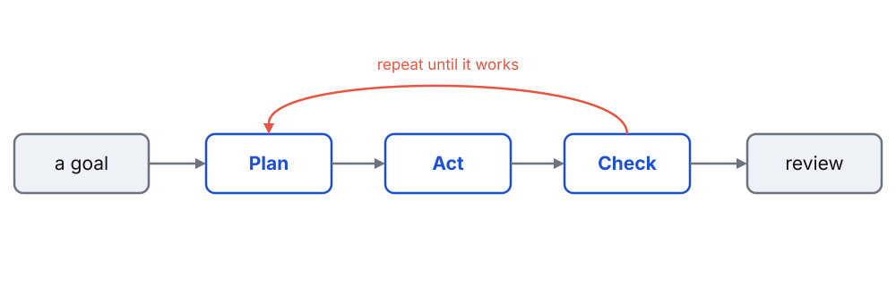

<!-- _class: title -->

<span class="eyebrow">NetSI PhD Bootcamp 2026 · Thursday, Sep 3 · 2pm–4pm</span>

# Agentic Computing

> Coding agents in your PhD workflow

Ankit Ramakrishnan · Minami Ueda

<span class="brandmark">Network Science Institute <span class="accent">·</span> Northeastern University</span>

---

# How this session works

- **~45 min** guided speed-run: what agents are, setup, the loop, tips
- **~60 min** <span class="pill">Hackathon</span> pick one of three projects:
  - **Dashboard website** · **Extend your Session 1 work** · **Recreate a paper**
- **~15 min** share-outs

---

<!-- _class: divider -->

# Part 1: Speed-run

<span class="brandmark">NetSI Bootcamp 2026</span>

---

# What is a coding agent?

> An LLM that can read files, run commands, and edit code, in a loop

- You state a *goal*, it plans, acts, checks its own work, and repeats
- It works on your **whole project**, in your **terminal**, not just one snippet
- You stay the reviewer: it drafts, *you* decide what to keep

Think pair-programmer that can also run the tests and read the errors.

---

# The loop



You give a goal. It plans, acts, and checks. You review the result.

---

# Setup (do this now)

<span class="pill">Hands-on Session</span>

1. Go to [claude.northeastern.edu](https://claude.northeastern.edu), click **First time? Start here**, accept the guidelines
2. Log in with **SSO** (your NU email + credentials)
3. We'll use **Claude Code** (in the terminal) and **Claude Desktop**

Generous NU usage limits. Prefer something else? OpenAI Codex or opencode (open source) work too.

---

# Claude Code in 30 seconds

Open a terminal *inside your project* and run `claude`:

```
$ claude
> load edges.csv and print the degree distribution

  I'll write a short script, run it, and show you the output.
  ... (creates degree.py, runs it) ...
  Top degrees: 42, 39, 31, ...  Saved a histogram to degree.png.
```

It reads your files, proposes changes, and can run them. You approve as it goes.

Run it in **VS Code's integrated terminal** and it connects to the editor: reads your
lint/type errors and shows edits as **inline diffs**.

---

# The core loop in practice

- Ask for an **outcome**, not keystrokes: *"make the plot log-scale and rerun it"*
- Let it **plan first** on anything non-trivial, and read the plan before you approve
- Work in **small steps**: run it, check it, then continue
- When a task is done, **start fresh** so old context doesn't leak in

---

# Best practice: a project memory file

> `CLAUDE.md` tells the agent your conventions, it reads this file automatically

- Put it at the repo root. Claude Code loads it every session
- `/init` will draft one for you from the codebase
- Keep it short: stack, how to run things, do's and don'ts
- Prefer `AGENTS.md` (a cross-tool convention)? Add a line `@AGENTS.md` in `CLAUDE.md` so Claude reads it too

```md
# CLAUDE.md
- Python 3.11, networkx + matplotlib. Run jobs with `sbatch`, not on the login node.
- Small diffs. Show me a plan before editing more than one file.
```

---

# Tips: work with it, not against it

- **Plan mode**, `Shift+Tab` cycles into it. It reads the code and writes a plan before touching files
- **Make it prove it**, the #1 habit: a quick test, a linter, or a UI screenshot so it checks its own work
- **Keep context clean**, one task per session. `/clear` when you switch, `/compact` a long one
- **Be specific**, say what and where, so it doesn't read the whole project to guess

---

# Git is your safety net

> Commit before a big change, so you can always go back

- **Commit first**, before you let it make a big change
- `git diff` to review exactly what it changed
- Keep it? `git commit`. Want to toss one file? `git restore <file>` (discards just that file)
- Let the agent run git for you, but understand each step. That's what makes experimenting safe

---

# Tips: power features (when you're ready)

- **Model choice**, use a stronger model to plan, a faster one to implement
- **Skills**, reusable `SKILL.md` guides that package a workflow or your house rules
- **Subagents**, spin up a helper for a side task (review, debug). It burns your limits faster
- **MCP**, connectors to external tools and data. Add sparingly to save context

---

# Guardrails (say them out loud)

- **Read what it runs.** You own every command it executes
- **Verify claims.** *"Tests pass"* means *you* saw them pass
- **No secrets** in prompts (keys, passwords, private data)
- The agent is **confident even when wrong**. Stay skeptical

---

# Read papers and find the literature

- **Read a paper:** pull out **claim ▸ evidence ▸ interpretation**, explain the method, check the math, find the weak points
- **At the start of a topic:** map the area, name the seminal papers, get a sensible reading order
- **Deep in it:** find the paper you're missing, what cites this, the related work you skipped
- **Verify:** agents *invent* citations. Confirm every reference actually exists

---

# Synthesize and hypothesize

- **Synthesize:** combine findings across papers into a comparison table, surface contradictions and gaps
- **Generate hypotheses:** brainstorm mechanisms, ask *"what would falsify this?"*, stress-test an idea before you sink weeks into it
- It widens the search. *You* decide which threads are worth chasing

---

# Prototype and unblock

- **Quick prototype:** turn an idea into a runnable script or notebook in minutes, just to sanity-check it
- **Escape dependency hell:** it reads the error, fixes the env, pins versions, gets you running again
- **The grunt work:** Slurm/conda, messy notebook ▸ clean script, reshape data, explain a stack trace, review for bugs

> It drafts and scaffolds. *You* write the science and verify every result.

---

# The frontier: auto research

> Set a goal and guardrails, then let it loop overnight


<span class="caption">Karpathy's [autoresearch](https://github.com/karpathy/autoresearch): an agent edits `train.py`, runs ~100 five-minute experiments overnight, keeping the ones that lower validation loss (`val_bpb`).</span>

*Reality check:* it drifts, over-claims, and burns compute. A tireless **assistant you supervise**, not a scientist. Verify everything.

---

<!-- _class: divider -->

# Part 2: Hackathon

### Three paths. Pick yours.

<span class="brandmark">NetSI Bootcamp 2026</span>

---

# Choose your project

| Track | Difficulty | You'll build |
| --- | --- | --- |
| **Dashboard website** | <span class="level beginner">beginner</span> | a static page that visualizes a network |
| **Extend Session 1** | <span class="level intermediate">intermediate</span> | more from your morning's cluster track |
| **Recreate a paper** | <span class="level intermediate">intermediate</span> | a result from a network science paper |

Prompts, starter files, checklists: **`hackathon/agentic/`**

---

# Track 1: Dashboard website

> <span class="level beginner">beginner</span> A static site that visualizes a network, built by the agent

- Loads a graph, draws it (nodes sized by degree), shows stats + a degree histogram
- Plain HTML + JS (vis-network or D3), no build step. Starter `network.json` included
- Great on-ramp: the focus is the *workflow*, not hand-writing web code

▸ `hackathon/agentic/track-1-dashboard/`

---

# Track 2: Extend your Session 1 work

> <span class="level intermediate">intermediate</span> Take this morning's cluster track further, with the agent

- Track A `▸` 2-D parameter sweep + heatmap
- Track B `▸` sweep GNN architectures
- Track C `▸` add an igraph comparison, or push the size ladder higher
- Practice: a cluster-aware `CLAUDE.md`, `sbatch --test-only`, verify the real job output

▸ `hackathon/agentic/track-2-extend-session1/`

---

# Track 3: Recreate a paper

> <span class="level intermediate">intermediate</span> Build this hierarchical network, then reproduce its result plots


▸ `hackathon/agentic/track-3-recreate-paper/` &nbsp;·&nbsp; arXiv [cond-mat/0206130](https://arxiv.org/abs/cond-mat/0206130)

---

# The plots to reproduce


<span class="caption">Your targets: **(a)** scale-free P(k) &nbsp;·&nbsp; **(b)** C(k) ~ 1/k, the hierarchy fingerprint &nbsp;·&nbsp; **(c)** clustering stays constant as N grows</span>

---

# A good first prompt

Vague in, vague out. Give it a goal, context, and a done-condition:

```
Goal: a static index.html that loads network.json and draws the
      network with nodes sized by degree, plus a degree histogram.
Context: network.json has nodes[{id,degree}] and links[{source,target}].
Use vis-network from a CDN, no build step.
Done when: the page opens with no console errors and the node count
      shown on the page matches network.json.
Plan it first, then build in small steps.
```

---

# Share-outs

> 60 seconds each

- **What I tried** (the goal)
- **What worked**
- **What broke**, and how you dealt with it
- **What I'd try next**

---

# Takeaways

- Agents are a **force-multiplier, not autopilot**. You plan and verify
- Most of the value: a tiny `CLAUDE.md` + small, verifiable steps
- Best combo: **cluster + agent**. You did both today

> Go use it on your actual research tomorrow.
